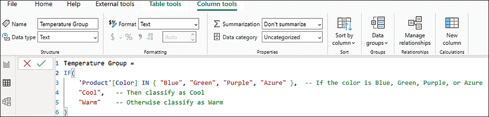
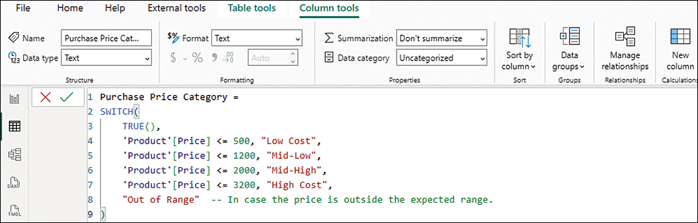
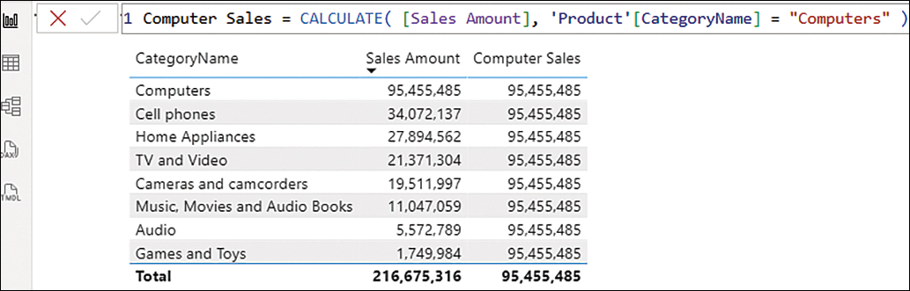
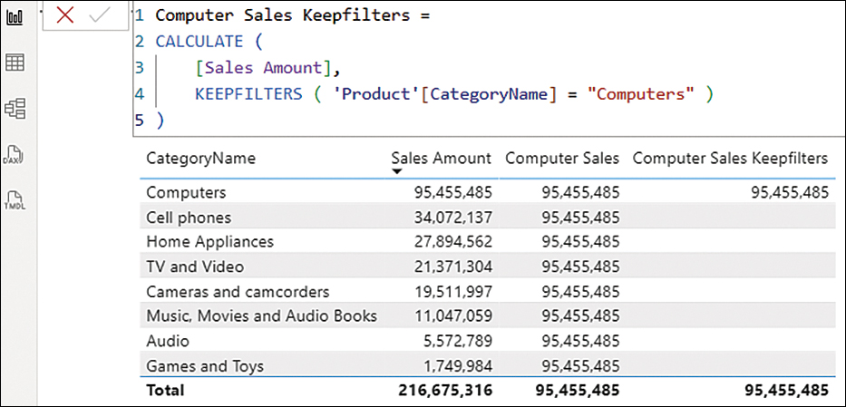
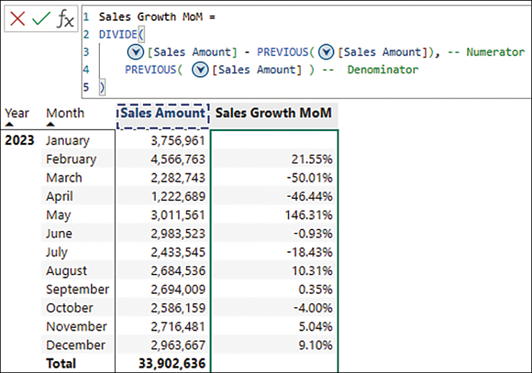
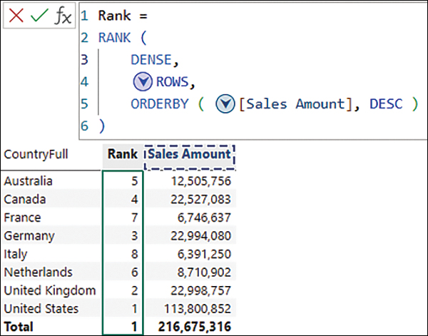

# Microsoft Power BI Cookbook - Third Edition ~ Greg Deckler, Brett Powell

Data Load
- Turn off Time Intelligence - **Auto date/time** for new files. 
- Select **Never detect column types** and headers for unstructured sources option

Current File 
- Turn off **Type Detection** and **Relationships**

Better to model explicitly. 


Power BI Desktop -- **pbix** 
Power BI Report Builder -- **rdl** Report Definition Language (actually, **XML** files eXtensible Markup Language)
**SSRS** SQL Server Reporting Services

**IaaS** Infrastructure as a Service
**ODBC** Open Database Connectivity


**ALM Toolkit** MAQ Software third party tool
**DAX Studio** Data Analysis Expressions
**AAS** Azure Analytics Service
**SSAS** SQL Server Analysis Services
**JSON** JavaScript Object Notation


**Semantic Model** collection of imported and direct query tables. Use **VertiPaq** in-memory columnar compressed storage engine

in-memory engine called **xVelocity**

**RLE** Run Length Encoding compression. 


# Microsoft Power BI Step by Step ~ Nuric Ugarte, José Rafael Escalante

## Introduction to PowerBI

Initially, set of **add-ins**. 
Official **PBI Launch 2015**. 

PBI: 
- **Desktop** 
- **Service** - Free, **Pro, Premium**
- **Mobile**

Windows 10+; Windows Server 2016+
2+GB RAM
16:9 display
1GHz 64bit processor
**WebView2** Runtime

PBI does not support personal email accounts. 

1. Canvas
2. Ribbon
   1. Home 
   2. Insert
   3. Modeling
   4. View
   5. Optimize
   6. External Tools
   7. Help
3. PowerBI Panels
   1. Data Pane
   2. Build/Visualizations Pane
   3. Filters Pane
4. Pages Tab
5. PBI Views
   1. Report View
   2. Data/Table View
   3. Model View
   4. DAX Query View
   5. TMDL View

Power Query - uses **M Code** (>700 functions)
- Ribbon
- Queries
- Query Settings
- Data Preview

Get Data - All, File, Database, Fabric, Power Platform, Azure, Online Services, Other
- Connection Settings
- Authentication
- Data Preview
- Query Destination

Get data from folder
- sample query based on first file. 
- function query that applies this to all other files. 

When connected to SQL Server, Power BI can pushback transformations to source using **Query Folding.** Happens automatically if transformation can be translated to **native SQL**

Changing storage mode to **Import** is irreversible action. 

**Import**
**DirectQuery** - **Limited DAX** functionality. 
**Dual Composite** 

Privacy Levels
- **Private**
- **Organizational**
- **Public**


Data Type, Columnar Transformations - Transform/Add Column
StateFul Column > Transform 
- **Fill Up** take following value and put in in missing. 
- **Fill Down** take prior value and put it in missing. 

Remove Duplicates
Combine Columns - Merge Columns
Extract Text
Replace Values
Group By
Unpivot - make data tall and skinny. Ex: stations on rows, months on cols, call volume as value to stations, month, value ; matrix to table. 
Pivot - make data short and wide; creating a matrix; ex: incident id, pivot by call type. each call type is a column. 

Merging tables
Appending tables

**Dimensional Modeling** - separating tables. **Star Schema**

**Fact tables** define an event. Verbs. Numbers.
**Dimension tables** describe events. Act as lookup tables. Nouns. Context. Who What Where When How

**Cross Filtering**

**`USERELATIONSHIP`** dax function can be used to move data through inactive filters.

**Layout**

**Calculated Columns** - Exception
**Measures** - Norm

**Calculated Tables**

**Visual Calculations** - ex `RUNNINGSUM`

DAX is not case sensitive. 

Measures always return scalar functions. 

`COUNT` - excludes blanks. 
`DISTINCTCOUNT` - unique values including blank. 
`COUNTROWS`

Iterator functions usually end in X. Aggregations with more than one col. 
Iterators are the only functions that allow access to row context. 
```dax
Incorrect Sales Amount = SUM ( Sales[Quantity] ) * SUM ( Sales[UnitPrice] )
Correct Sales Amount = SUMX ( Sales, Sales[Quantity] * Sales[UnitPrice] )
Total Product Cost = SUMX ( Sales, Sales[Quantity] * RELATED ('Product'[Cost] ) )
```





**`CALCULATE`** only function that can modify filter context. 

```dax
Sales Amount (Canada) = CALCULATE( [Sales Amount], Customer[CountryFull] = "Canada" )


REMOVEFILTERS Quantity =
DIVIDE (
    [Total Quantity], -- Numerator
    CALCULATE ( [Total Quantity], REMOVEFILTERS ( ( 'Product'[Manufacturer] ) ) -- Denominator
)
ALLSELECTED Quantity =
DIVIDE (
     [Total Quantity], -- Numerator
    CALCULATE ( [Total Quantity], ALLSELECTED ( 'Product'[Manufacturer] ) )
-- Denominator
)
```


**Overwriting filters** - using same column from the `CALCULATE` filter argument in visual object


Use `KEEPFILTERS`


`USERELATIONSHIP` - behavior modifer. 






