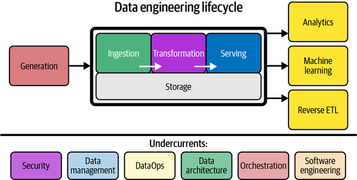
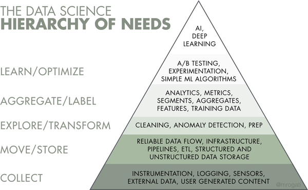
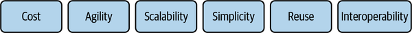
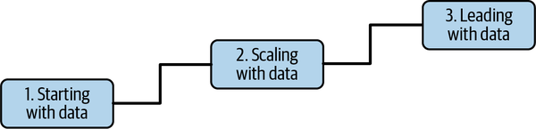
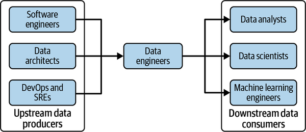
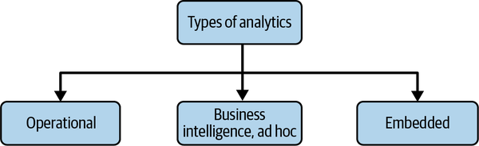

## Fundamentals of Data Engineering - Joe Reis, Matt Housley

### 1. Data Engineering Described

Develop, Implement, Maintain. 
Systems, Processes. 
Store, Process, Serve. 
SQL, Big Data - Hadoop. 

1989 - Bill Inmon coined term "Data Warehouse".
IBM developed relational database and SQL.
Oracle popularized it. 

Big Data 3V's - Velocity Variety Volume

MPP Massive Parallel Processing

2003 Google File System paper
2004 Google MapReduce paper

2006 Yahoo Apache Hadoop Open Source

Amazon 
- Elastic Compute Cloude EC2
- Simple Storage Service S3
- DynamoDB - NoSQL DB

GoogleCloud, Microsoft, DigitalOcean cloud service providers followed. 

Batch Computing vs Event Streaming

Matt Turck Data Landscape https://mad.firstmark.com/

Gather, Clean, Process. Then AI or ML Analysis. 

Between getting data and getting value from the data. 

Data Maturity: Progression towards higher data utilization. Leveraging data for a competitive advantage. 

DMM Data Maturity Model.

Recovering data scientists, premature data science projects without adequate data maturity or data engineering support. 

Business goals and Competitive advantage aimed. Define right data architecture. Build solid data foundation. 

Custom solutions and code should mean competitive advantage. 

Technology decisions should be driven by the value being delivered. 

Shift focus to pragmatic leadership. 

Hobby projects not delivering value. 

View responsibilities through business and technical lenses. 

Communication is key. 
Understand how to scope and gather business and product requirements. 
Understand cultural foundations of Agile, DevOps, and DataOps. 
Control costs. 
Learn continuously. 

SQL, Python, Java, Scala, Bash, PowerShell. 
JSON
dbt Data Build Tool - SQL Management framework
awk, sed.

R, JavaScript, Go, Rust, C, C++, C#, Julia. 

External Facing vs Internal Facing Data Engineer. 

Data Architects. Battle Scars. Experience. Policies & Strategies. 
Software Engineers. 
DevOps Engineers.
SREs Site Reliability Engineers. 

Data Scientists. forward looking. predictions, recommendations. 
Data Analysts | Business Analysts. past, present. 
ML Engineers | AI Researchers 

CEO Chief Executive Officer. 
CIO Chief Information Officer. IT + Business. 
CTO Chief Technology Officer. 
COO Chief Operating Officer. 
CDO Chief Data Officer. 
CAO Chief Analytics Officer. 
CAO-2 Chief Algorithms Officer. 

Project Managers. 
Product Managers. 

## 2. Data Engineering Life Cycle. 

Generation: 
- Source Systems. 
- Schemaless vs Fixed Schema.

Storage: 
- Ingestion, Transformation, Serving. 
- Data Temperatures/Access Frequency (hot - frequently accessed, lukewarm, cold)

Ingestion: 
- Batch vs Streaming. 
- Push vs Pull. 
- CDC Change Data Capture vs ETL Extract Transform Load. 
- CDC - push to a message queue, use binary logs to record every database commit. Timestamp based CDC - pull. 

Transformation:
- Business logic drives data transformation
- Data featurization for ML

Serving:
- Data projects must be intentional. Must add value.

