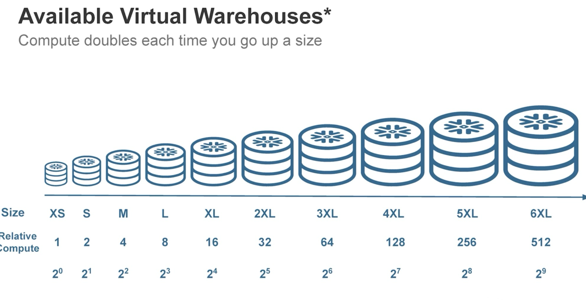

### Query: How does `SELECT TOP 10 *` execute in Snowflake without an `ORDER BY`? (Table size: 100 rows)

#### Core Concept: Short-Circuiting
* **No Full Scan:** The database skips reading the entire table.
* **Micro-Partition Access:** Snowflake opens the first accessible **micro-partition**, reads exactly **10 rows**, and halts. 
* **Storage Order:** The rows returned are based on their natural *ingestion order*, as data is not globally sorted by default.

#### Crucial Caveats
* *Non-Deterministic:* Do not rely on this query for consistent outputs in automated ELT pipelines.
* **The `ORDER BY` Trap:** Adding `ORDER BY` forces a **full evaluation** of the dataset because the engine must sort all rows to determine which ones legitimately qualify as the "Top 10".

  

### Query: Explain Snowflake stages (internal/external, user/table/named), direct loading requirements, reusability, dropping, and referencing.

#### Core Concepts: Stages
A stage is a temporary cloud storage holding area for files.
* **External Stage:** Your cloud storage (S3, Azure, GCS).
* **Internal Stage:** Snowflake's managed cloud storage.

#### Internal Stage Types
* **User (`@~`):** Personal to the user. *Cannot be dropped or shared.*
* **Table (`@%`):** Tied strictly to one table. *Cannot be dropped or shared.*
* **Named (`@name`):** Standalone database object. *Can be dropped, secured via RBAC, and shared across multiple tables.* **(Production Standard)**

#### Mechanics & Usage
* **Is a stage mandatory?** Yes, for bulk loading files via `COPY INTO`. No, for standard `INSERT` statements (though `INSERT` is inefficient for bulk data).
* **Reusability:** Named/External stages can serve *many* tables. Table stages serve *one*.
* **Referencing:** Use the `@` prefix. 
    * User: `@~`
    * Table: `@%table_name`
    * Named: `@stage_name/path/`

#### Caveats
* *Storage Costs:* Internal stages accrue storage fees. Always clean up files using `REMOVE` or `PURGE = TRUE`.
* *Security:* Use **Storage Integrations** for External Stages instead of hardcoded API keys.
* *Best Practice:* Avoid Table stages in collaborative ELT pipelines to prevent file naming collisions.

  

### Query: Snowflake Data Types (6 categories), Standard Views vs Materialized Views vs Dynamic Tables, how they update, limitations.

Numeric, String/Binary, Logical, Date/Time, Geospatial, Semi-structured. 

#### Core Data Types highlight
* Snowflake handles standard types, plus native Geospatial.
* *Crucial concept:* **Semi-Structured** (`VARIANT`) parses JSON/Parquet into columnar storage automatically, queryable via SQL dot-notation.

#### View Architectures & Refresh Mechanics
* **Standard Views:** Saved queries. *Always fresh.* Burns compute on every read. Stores no data.
* **Materialized Views (MVs):** Pre-computed and stored on disk. 
    * *Updates:* Automatic & continuous via Snowflake serverless compute.
    * *Limitation:* **Single-table only.** No joins. Best for heavy aggregations on static/append-only tables.
* **Dynamic Tables (DTs):** Declarative data pipelines. Stored on disk.
    * *Updates:* Automated based on defined **`TARGET_LAG`** (e.g., '10 minutes'). Uses a user-specified Virtual Warehouse.
    * *Advantage:* **Supports complex multi-table joins.** Replaces traditional scheduled ELT tasks.

#### Caveats
* *Cost Trap:* High churn on MV base tables causes massive hidden serverless compute bills.
* *Always-on Compute:* Setting a tight `TARGET_LAG` on a DT keeps your warehouse awake 24/7.
* *Data Freshness:* DTs inherently serve *stale data* bounded by the lag parameter.

  

### Query: Semi-structured data types (JSON, Avro, ORC, Parquet, XML), VARIANT, ARRAY, OBJECT, dot notation, position indexing, and LATERAL FLATTEN.

#### Core Data Types
* **`VARIANT`:** Universal data type that natively holds semi-structured data in columnar format.
* **`OBJECT`:** A dictionary (key-value pairs).
* **`ARRAY`:** An ordered list. *Every element inside an array is a `VARIANT`.*

#### Querying Mechanics
* **Dot Notation:** Use `:` to enter the variant column, and `.` to traverse nested objects (e.g., `column_name:parent_key.child_key`).
* **Position Indexing:** Use brackets to grab array elements via 0-based indexing (e.g., `column_name:array_key[0]`).
* **`LATERAL FLATTEN(input => ...)`:** A table function used to *explode* (unnest) arrays or objects into standard relational rows. 

#### Crucial Caveats
* *Mandatory Casting:* Always explicitly cast extracted values (e.g., `::string`, `::int`). Uncast strings retain literal double quotes (`"value"`), which ruins `JOIN` and `WHERE` conditions.
* *Case Sensitivity:* JSON keys are **strictly case-sensitive**.
* *Performance Threat:* `LATERAL FLATTEN` multiplies rows. Filtering the base table prior to flattening is critical to avoid blowing up Virtual Warehouse memory and causing disk spills.

  

### Query: Snowflake architecture - 4 layers (Optimized storage, Elastic compute, Cloud services, Snowgrid)

#### 1. Optimized Storage (Data)
* **What it is:** Centralized data repository residing on cloud object storage (S3/Azure/GCS).
* **Mechanics:** Data is automatically compressed, organized into columnar format, and stored in immutable **micro-partitions**. 

#### 2. Elastic Multi-Cluster Compute (Virtual Warehouses)
* **What it is:** MPP massive parallel processing compute clusters executing the queries.
* **Mechanics:** **Completely decoupled from storage.** Enables *Workload Isolation*—multiple warehouses can hit the same data concurrently without locking or performance degradation. 

#### 3. Cloud Services (The Brain)
* **What it is:** The management tier. 
* **Mechanics:** Handles authentication, metadata management, query optimization, and transaction control. Always active and managed by Snowflake.

#### 4. Snowgrid (Cross-Cloud & Global)
* **What it is:** The global interconnect layer.
* **Mechanics:** Enables cross-region and cross-cloud replication, failover, and secure data sharing (Clean Rooms) without moving or copying data via traditional ETL.

#### Crucial Caveats
* *Cost:* Cloud Services are billed if they exceed **10%** of your daily compute usage. 
* *Budget Drain:* Failing to set aggressive `AUTO_SUSPEND` on compute clusters leads to massive bills.
* *Snowgrid Gotcha:* Cross-cloud replication incurs significant cloud provider **egress network fees**.

  

### Query: Clone table, query id, variables, show variables, time travel (timestamp, offset, before query), retention period, seven day failsafe, permanent vs transient vs temp tables. Is cloning at an offset still zero copy?

#### Variables & Query IDs
* **Variables:** Set using `SET var_name = value;`. Retrieve using `$var_name`. View all via `SHOW VARIABLES;`.
* **Query ID:** A unique UUID generated for every executed statement. Essential for identifying exactly which query corrupted data so you can Time Travel *before* it.

#### Time Travel & Fail-safe Mechanics
* **Time Travel:** Access historical data using `AT` (Timestamp or Offset in seconds) or `BEFORE` (Statement Query ID).
* **Fail-safe:** A hardcoded **7-day disaster recovery window** strictly controlled by Snowflake Support. *You cannot query Fail-safe data.*

#### Table Types (Storage Management)
* **Permanent:** Time Travel (0-90 days) + Fail-safe (7 days). Highest storage cost.
* **Transient:** Persists until dropped. Time Travel (0-1 day). **No Fail-safe.** Ideal for ELT staging.
* **Temporary:** Session-bound. Drops on disconnect. Time Travel (0-1 day). **No Fail-safe.** *Gotcha: Will mask permanent tables with the same name.*

#### Concept: Time Travel Cloning
* **Question:** Is cloning a table at a past offset (e.g., 1 hour ago) still zero-copy if the original table has changed?
* **Answer:** *YES.* Snowflake micro-partitions are immutable. Changes create *new* files. The clone operation simply generates metadata pointing to the exact state of the immutable micro-partitions as they existed 1 hour ago. No physical data is duplicated.

  

### Query: Resource monitors (Account level vs Warehouse level) and actions (Notify, Suspend, Suspend Immediate).

#### Core Concept: Cost Guardrails
Resource Monitors track compute credit consumption and trigger automated actions to prevent budget overruns.

#### Scope Limits
* **Account-Level:** Max of **1** per account. Tracks all warehouses combined.
* **Warehouse-Level:** Can be assigned to 1 or more warehouses. *A single warehouse can only have 1 monitor assigned to it.*

#### Trigger Actions
* **`NOTIFY`:** Sends an alert. *Compute continues.*
* **`SUSPEND`:** Blocks new queries. *Lets running queries finish.*
* **`SUSPEND_IMMEDIATE`:** **Cancels all running queries** and forces the warehouse to shut down instantly.

#### Crucial Caveats
* *Not Comprehensive:* **Does NOT track serverless compute** (Snowpipe, Materialized Views, Serverless tasks) or storage costs.
* *Latency Delay:* Suspensions are not millisecond-perfect; massive warehouses might slightly overshoot the quota before the kill signal processes.
* *Role Requirement:* Creation requires `ACCOUNTADMIN` privileges.

  

RBAC
Securuable Objects -- entities
Privileges
ROles - inheritence
Users

Roles - Org Admin, Sec Admin, User Admin, Sys ADmin, Public

 

Snowflake Drivers - jdbc, nodejs, snowflake connector python, 
vscode extension
Snowpark UDFs, SotredProcedures, DataFrames, ML, ContainerServices
ITD Ingestion Transformation Delivery
Python worksheets -- require return statements
Handler 

Snowflake Session
Snowflake CLI
pip install snowflake-cli-labs
app, connection, object, snowpark, spcs, sql, streamlit

--- M3

Snowflake Data Engineering
Ingestion - streaming: kafka, snowpipe; batch - copy; snowflake native connectors; inplace data sharing across regions
Transformation - snowpark dataframes, dynamic tables, stored procedures, udfs, udtfs, sql
Orchestration - streams - tagged to tables, tasks
Observability - alerts, notifications, logs, events, visual dag

Snowpipe - pipe with autoingest
AccessPolicy AWS
AWS Role
Snowflake integration
AWS Role to aware of snowflake integration
How do the communication work

GenAI With Snowflake
- Snowflake Governed Data
  - Snowflake Cortex: Serverles AI, LLM, Search Functions
    - Use AI In Seconds
      - DocumentAI
      - UniversalSearch
      - Snowflake Copilot
    - Apps In minutes
      - Streamlit
  - Snowpark Container Services
    - OSS LLMs, Fine Tuning, Partner LLMs
    - Custom UI, Custom Orchestration

Cortex LLM Functions
- Summarize
- Sentiment
- Extract_answer
- translate

Tokens
Embeddings
Context -- role - system, user, assistant, content

ML With Snowflake
- Snowflake Governed Data
  - Virtual Warehosue: Standard, Snowpark Optimized
    - Snowflake Cortex ML Functions -- forecast, anomaly detection, top_insights, classification; GBM gradient boosted machine
    - Development
      - Notebooks - sql, markdown, python
      - Snowpark ML Modeling - XGB Classifier, LightGBM
    - Production
      - Feature Store - manage model features, columns
      - Model Registry - model management
    - Consumption
      - Streamlit in Snowflake
  - Snowpark Container Services: GPU and CPU powered

XGBoost -- tree based
XGBClassifier

Applications with Snowflake
Backend, Frontend, API
Snowflake - ODBC|JDBC|SQLAlchemy|Connector for Python|.net|PHP|GO|Nodejs
Django Snowflake Connector
Snowflake Python API
Hybrid Tables
Custom frontend, Snowflake backend
Snowflake hosted - streamlit, front end hsoted in snowpark containers

Snowflake Data Cloud
Snowflake Organizations
