# Mathematics for ML

## Linear Algebra 

### 1. Systems of Linear Equations

Basics:
- Addition & Subtraction -- same rows and cols
- Scalar multiplication -- element wise multiplication
- Matrix multiplication -- Dot Product -- cols in A = rows in B
- Non-Singular -- det(A) != 0; Inverse exists. All equations are linearly independent. Exactly one unique solution. 
- Singular -- Non invertible. det(A) = 0; Linearly dependent (cols/rows); No solutions or infinitely many solutions. Lines are parallel (no solution) or Lines are on top of each other (many soltuions)

Youtube: **Serrano Academy**
Book: **Rocking Machine Learning**

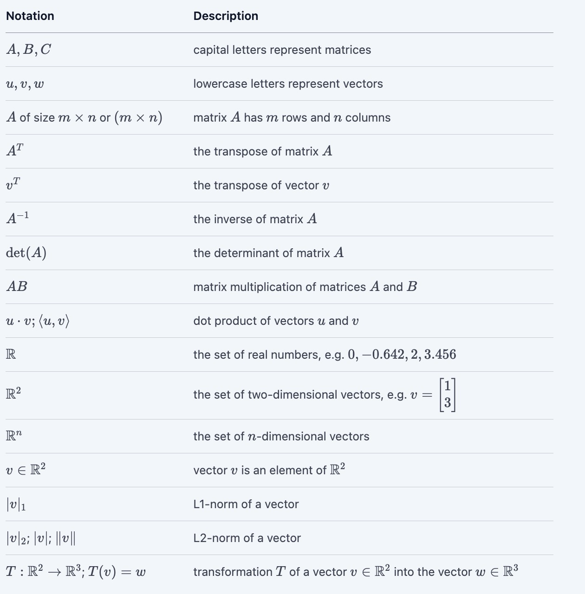

$y = wx + b$
$y = w1x1 + w2x2 + b$

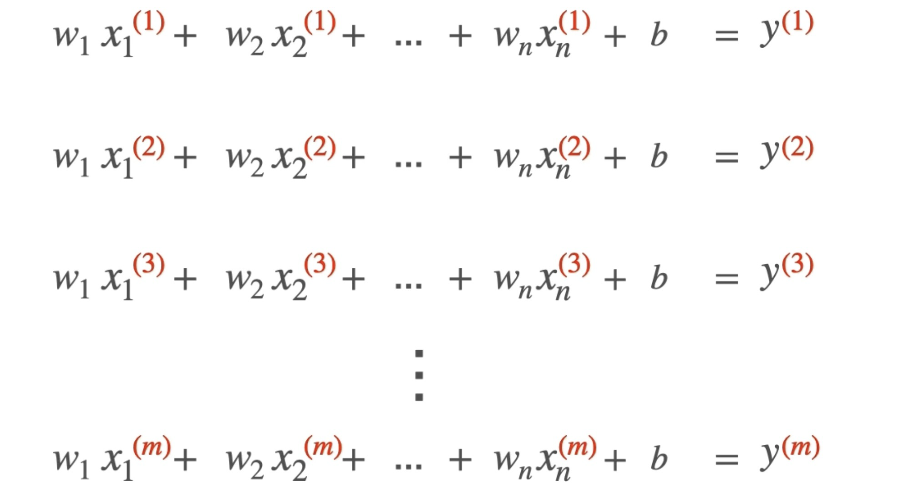

superscript -- data point | ith row

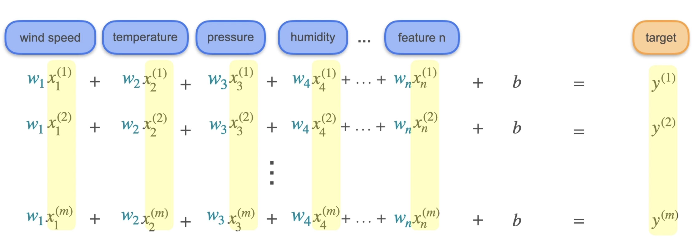

$ws$ and $b$ are same across all rows while the x superscripts are different for each row. 

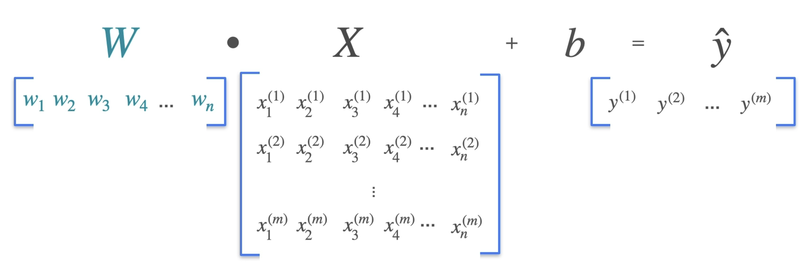

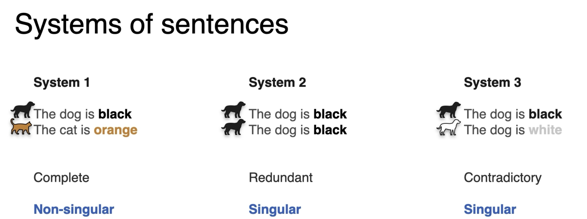

Rank -- How redundant a system is. 

Equations behave a lot more like sentences. They are statemetns that give out information. 

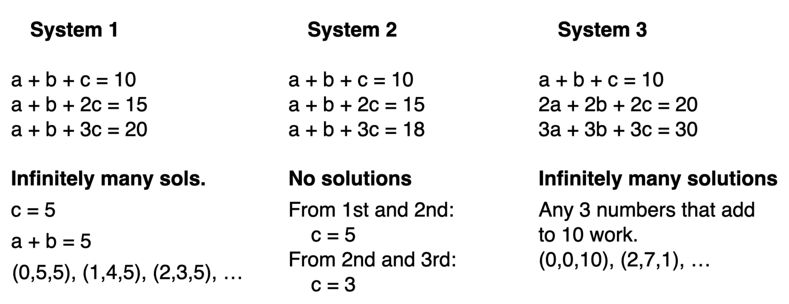


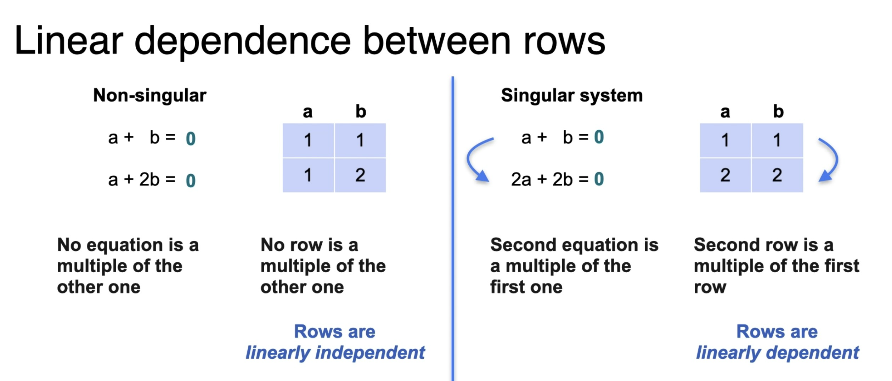

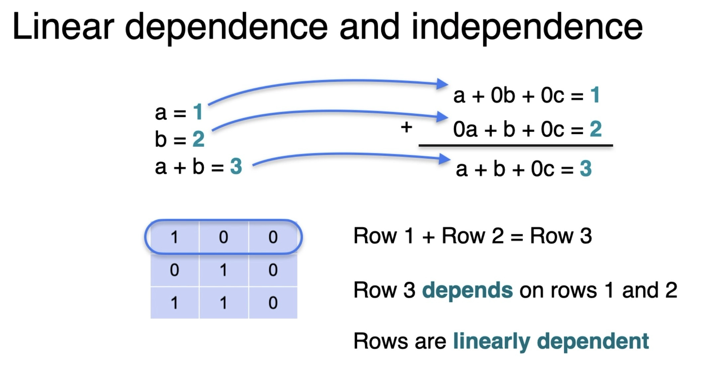

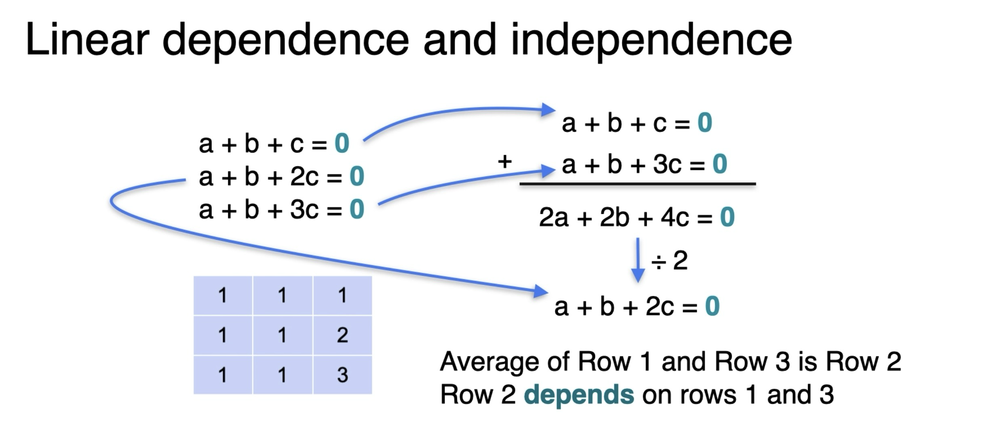

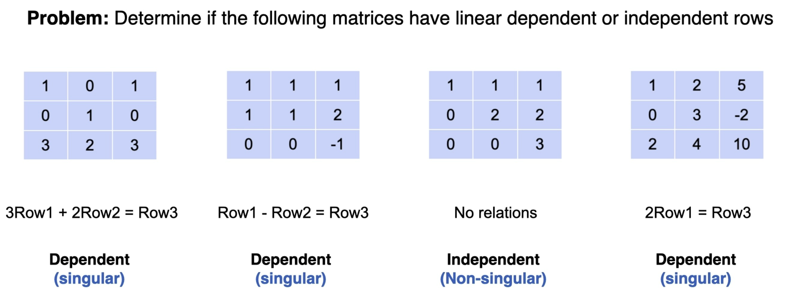

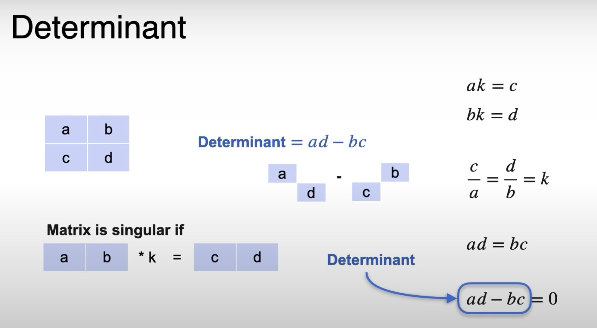

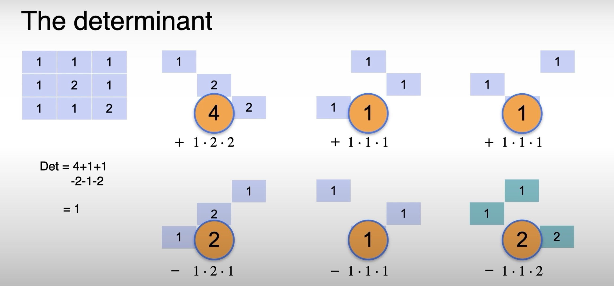

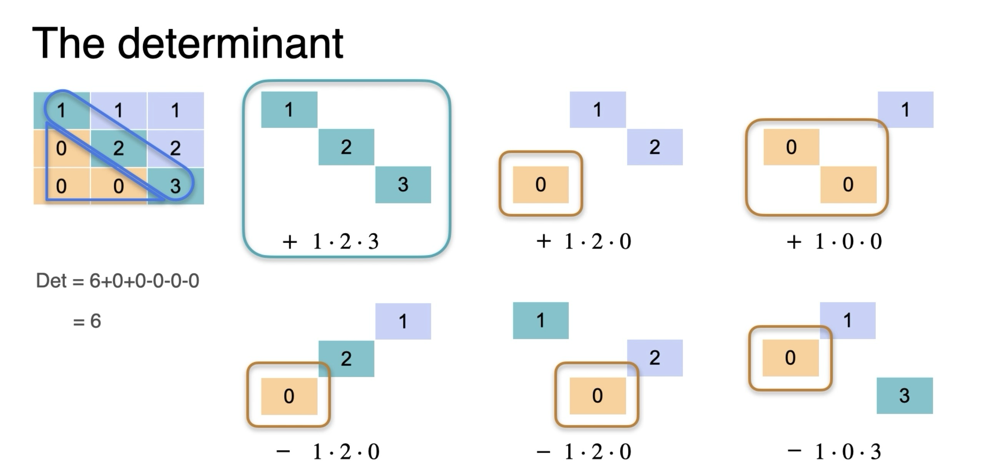


```py
np.array(list_of_numbers)

# < indicates Little Endian Architecture; LSB is stored at smallest memory address. 
# U unicode string

a = np.array([1, 2, 3]) # 1D
b = np.array([[1, 2], [3, 4]]) # 2D

np.arange(start, stop, step) # evenly spaced values
np.linspace(start, stop, num)
np.ones(shape)
np.zeros(shape)
np.empty(shape) # contains garbage
np.random.rand(shape) # between 0 and 1
np.reshape(a, newshape) 


ndarray.ndim # axes
ndarray.size # n elements
ndarray.shape 

# broadcasting 
# NumPy compares the shape of two arrays starting from the right (trailing dimension) and working left. Two dimensions are compatible if:

# 1. They are exactly equal, OR
# 2. One of them is 1

np.newaxis # artificially add a dimension of 1 to force broadcasting

a[start:stop:step]
a[:]
a[::]
a[::-1] # reverse
matrix[0:2, 1:3]

np.hstack((a, b)) # column wise
np.vstack((a, b)) # row wise
np.hsplit(a, indices)


A = np.array([[2, 3], 
  [5, -1]])
b = np.array([8, 3])

x = np.linalg.solve(A, b)
# Returns [1., 2.] (meaning x=1, y=2)

# This will crash with a LinAlgError if the system is singular (no unique solution).

np.linalg.det(A) # if det(A) = 0; Singular. 
```


Week 1: https://assets.deeplearning.ai/courses/machine-learning-linear-algebra/assets/pdf/week-1-slides.pdf


$Ax = b$ 

If A is singular, data is redundant or contradictory. 

Rank of A is the maximum number of linearly independent column vectors. Represents true dimensionality. 

### 2. Solving systems of linear equations

Matrix row reduction -- Gaussian elimination
Row Echelon Form -- 1s in diagonal. 0s underneath the diagonal. 

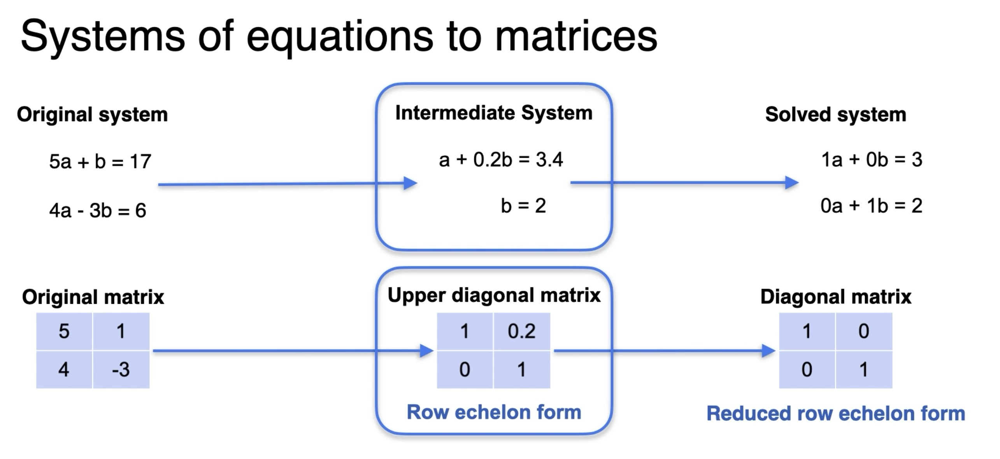

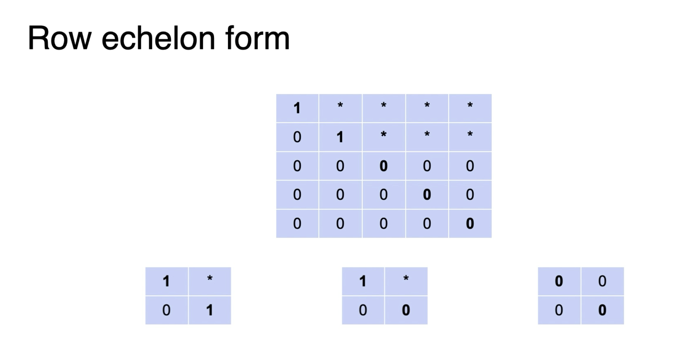


Operations preserving singularity
1. Row operations
   1. Switching Rows
   2. Multiplying a row by a non zero scalar
   3. Adding a row to another row

```py
A = np.array([
        [4, -3, 1],
        [2, 1, 3],
        [-1, 2, -5]
    ], dtype=np.dtype(float))

b = np.array([-10, 0, 17], dtype=np.dtype(float))

x = np.linalg.solve(A, b)
d = np.linalg.det(A)

# LinAlgError: Singular matrix


```
   